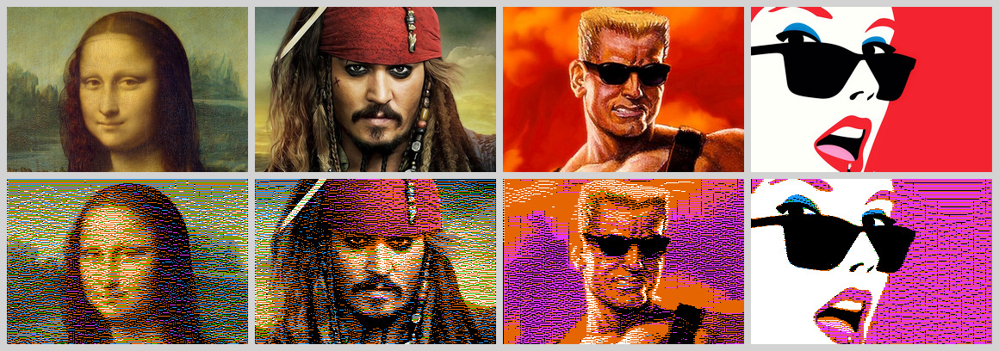

Apple ][ HiRes Image Converter
==============================



This program is a proof of concept for converting arbitrary RGB images into the
Apple ][ HiRes mode color palette.

I assume that the reader is familiar with the HiRes mode quirks and limitations.
If not, here's a [good read](https://www.xtof.info/hires-graphics-apple-ii.html) on the subject.

Preamble
--------

Translating images into a smaller color palette is not new and is widely used. For instance
one of the oldest dithering algorithms, the [Floyd-Steinberg], still produces good results.

Problems with the HiRes mode arise from inability to choose a color for one pixel without
affecting others. Pixel color depends on neighbouring pixels, the palette chosen for a whole
septet of pixels, and even whether the pixel is in an even or odd column on the screen.

I couldn't find a way to propagate the quantization error to the pixels within the same line
like Floyd does. In my algorithm, errors only diffuse down.

The Tool
--------

The prototype is written in Node.js. The program takes two arguments, the source image name,
and the output name. The source image can be in any mainstream image format but must be
exactly 280x192 pixels in size. The output is always PNG.

Example usage:

```shell
node index.js in/1.png out/1.png
```

Algorithm
---------

Colors are quantized in 7-pixel blocks corresponding to a single byte in HiRes. All values of
a byte are enumerated. Additionally all combinations of the least significant and most significant
bits of the next byte are enumerated. A previous byte is already known at the time a block is
quantized. Its two most significant bits are taken into account as well.

This data is used to compute 9 HiRes pixels in a given color palette and a variant of fill rules.
Then the middle 7 pixels are compared to the 7 pixels of the original. A square of the distance
between each pair of the pixels in RGB space is computed, and their sum is used to choose the best
match. The byte value which produces the lowest sum wins. The two assumed bits of the next byte
are dropped and are not used in the subsequent computation.

This last step results in a certain error. The byte value for the current septet is chosen
assuming optimal contents of the next byte. However when the next byte is computed this decision
is not taken into account. This can result in the color of the 7th pixel being different in the
final image compared to the optimal. E.g. it can be white instead of a color, or a color instead
of black. Practical results seem to be rather good despite this imprecision.

After all bytes have been chosen for a line it is rendered as a whole according to the HiRes rules.

Finally a modified Floyd-Steinberg algorithm is used to deal with quantization errors. A difference
is computed between the original and the quantized colors for every pixel of the line. This difference
is split into 3 parts and is added to the original pixel colors of the next line directly under the pixel
where the error was computed.

And this process repeats for all lines.

Implementation
--------------

The actual implementation has some optimizations. Mainly it builds a table of all possible 9-pixel
color sequences beforehand to speed up color matching.

The code related to the algorithm itself is in `converter.js`. `index.js` contains glue code to make
converter work as a Node command-line tool.

This program does not produce the actual HiRes memory image suitable for displaying on an actual
Apple ][ or in an emulator. However this feature can be easily added.

[Floyd-Steinberg]: (https://en.wikipedia.org/wiki/Floyd%E2%80%93Steinberg_dithering)